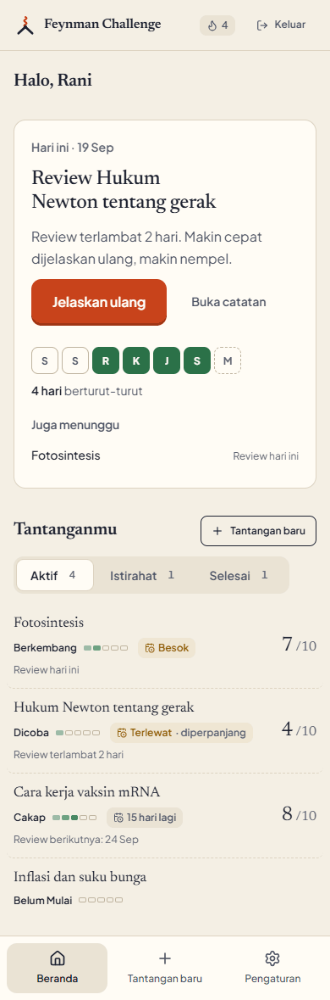
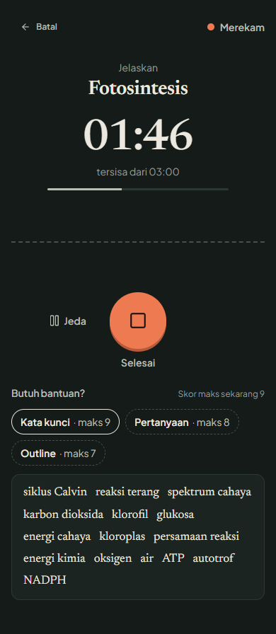
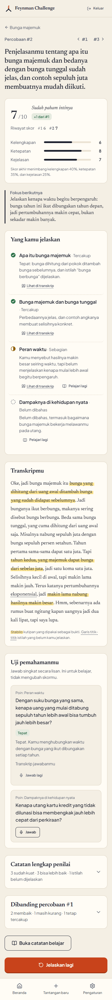
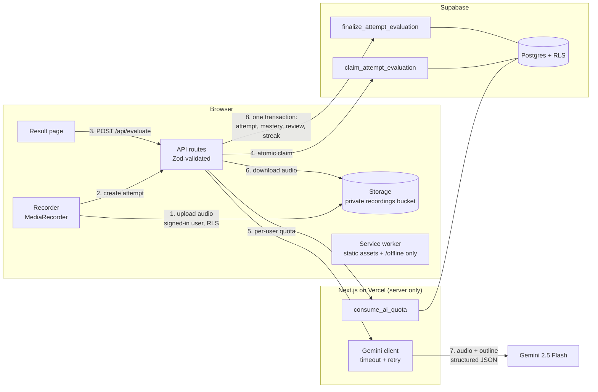
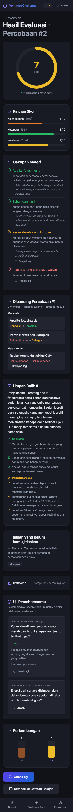
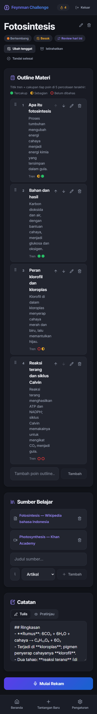
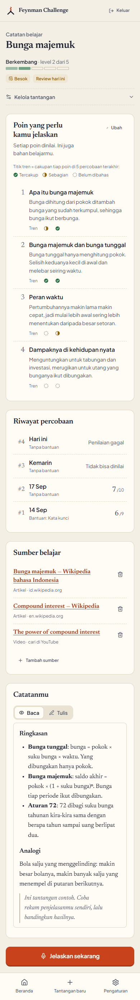

# 🧠 Feynman Challenge

<p align="center">
  <a href="https://github.com/muhimranhidayathamzh/feynman-challenge/actions/workflows/ci.yml"></a>
  
  
  
  <a href="LICENSE"></a>
</p>

> _"Kalau kamu nggak bisa menjelaskannya, kamu belum paham."_
> A PWA that helps self-learners master any topic with the **Feynman Technique**: explain it out loud, and let AI tell you exactly which parts you really understood.

<p align="center">
  
  
  
</p>

**Try it without an account:** the landing page has a **"Coba tanpa akun"** button (demo mode) that signs you in anonymously and takes you straight to creating a challenge on a topic of your own. No email needed; these accounts get a tighter AI quota.

---

## ✨ What it does

You pick a topic. AI drafts a learning outline and sources. You study, then **record yourself explaining it**. The recording goes straight to Gemini (multimodal audio), which transcribes it and grades it against your outline: comprehensiveness, accuracy, and clarity, with per-point coverage and quotes from what you actually said. Then the app tells you what to study next and when to come back.

### Features

- **AI learning plans**: outline, suggested sources, and a recording length sized to the topic.
- **Notebook**: editable outline (drag or arrows), sources, and markdown notes with autosave and preview. Each outline point shows a **coverage trend** of your last 5 attempts, and every attempt, finished or not, stays one tap away in the **attempt history**.
- **Immersive recording**: countdown, live waveform, pause/resume, listen-before-send, and **tiered hints** generated per outline point that cap the maximum score (none 10, keywords 9, guiding questions 8, outline 7).
- **Trustworthy evaluation**: one Gemini call returns transcript, sub-scores, one coverage verdict per outline point with a quote as evidence, and unexplained jargon. The overall score is computed on the server. Unusable audio (silence, noise, wrong language) is rejected without a score.
- **Close the gap**: every partial or missing point has **"Pelajari lagi"**, which opens the notebook at that point. The result page compares each point with your previous attempt: improved, declined, still weak.
- **Socratic coach**: 1–2 follow-up questions aimed at your weakest point, answered by voice and graded (tepat / sebagian / keliru). Answers never change your score.
- **Review reminders by email**: on the day a review falls due, one gentle email listing everything waiting, at most once a day, never to demo accounts. Switch it off in Pengaturan or from the link in any email, no sign-in needed.
- **Spaced repetition**: Leitner boxes (1, 3, 7, 14, 30, 60 days) decide when each topic comes back. Mastery climbs `not_started → attempted → developing → proficient → mastered → solidified` and slips a level if a review is badly overdue.
- **Gentle accountability**: deadlines are calendar days in your timezone, missed ones auto-extend once, and streaks count real completed evaluations.
- **Demo mode**: anonymous sign-in straight into creating a challenge on your own topic, a stricter AI quota, and a one-step path to keep the account (link an email, then set a password).
- **Four layers of cost control**: a per-user AI quota enforced atomically in SQL, tighter limits for demo accounts, an app-wide daily ceiling, and a kill switch — the last two flipped from the SQL editor with no redeploy.
- **Plain-language privacy and terms**: `/privasi` and `/syarat` say what is stored, that recordings go to Google Gemini, how long things are kept, and how to delete them. The recording screen and the sign-up form repeat the one sentence that matters.
- **Your data, deletable**: deleting the account removes every recording first and then the account, whose rows follow by cascade. A maintenance job clears recordings nothing points at and demo accounts idle for a week.
- **Installable PWA**: maskable icons, shortcuts, an offline page, and a service worker that never caches private pages.
- **"Kertas & Kapur" interface**: a warm paper light theme for studying and a chalkboard dark theme for the recording stage, in Newsreader and Plus Jakarta Sans. One action per screen, evidence before numbers, and never red for a learning gap. The rules live in [`docs/design/DESIGN.md`](docs/design/DESIGN.md) and are enforced by `npm run design:check`.

---

## 🏗️ Architecture



- **Server-first**: pages are React Server Components reading through a per-request Supabase client. Interactivity lives in small `"use client"` islands.
- **Security**: `GEMINI_API_KEY` and the service-role key are server-only (`src/lib/env.ts`). Every table has Row Level Security. Model output is validated with Zod, and user text inside prompts is fenced against prompt injection.
- **Middleware**: refreshes the session, guards private routes, and only allows same-origin `?next=` redirects.

```
src/
├── app/
│   ├── (auth)/                 # login, signup, password reset
│   ├── (app)/                  # dashboard, notebook, results, settings
│   ├── challenge/[id]/record/  # full-screen recorder
│   ├── offline/                # service-worker fallback (static, no user data)
│   └── api/                    # challenge CRUD, generate, evaluate, follow-ups
├── components/                 # ui, layout, auth, challenge, recording, evaluation, dashboard
├── lib/                        # supabase/, gemini/, ai/, auth/, demo/, pwa/, storage/, utils/
├── styles/                     # design tokens + feature stylesheets (vanilla CSS)
└── types/                      # Database types + shared domain types
```

---

## 🧭 Technical decisions

| Decision | Why |
|---|---|
| **Gemini multimodal instead of a separate speech-to-text service** | One request returns transcript and grading together. It hears hesitation and self-corrections, handles Indonesian well, and costs nothing on the free tier. |
| **Direct browser upload to Storage** | The audio never passes through a serverless function, so there is no 4.5 MB body limit and no double transfer. The API only receives a path it verifies belongs to the user. |
| **Transactional RPCs for evaluation** | `claim_attempt_evaluation` prevents double evaluation from retries or two tabs. `finalize_attempt_evaluation` writes the attempt, mastery, review schedule, and streak in one transaction, so a crash can never leave them out of sync. |
| **Score computed on the server** | Gemini returns sub-scores only. The weighted overall score and the hint cap are applied in code (`src/lib/utils/scoring.ts`), so the model cannot drift the formula. |
| **Deadlines as calendar days + user timezone** | "Today" is always computed in the learner's IANA timezone. Auto-extension and streak display are derived at read time instead of being stored and going stale. |
| **Spaced repetition over time decay** | Leitner boxes schedule the next review from performance. Early reviews do not earn promotions, so "solidified" really means spaced, successful recall. |
| **Quota in SQL** | `consume_ai_quota` counts calls atomically, so concurrent requests cannot slip past the limit. Anonymous demo accounts get tighter limits. |
| **The emergency brake lives in SQL, not in env vars** | Per-user quota is the wrong unit for a public site: anonymous sign-in means accounts are free to mint. `app_settings` holds an `ai_enabled` switch and a daily ceiling read inside `consume_ai_quota`, so spend can be stopped in one `UPDATE`, with no deployment. The global count deliberately skips a global lock — a small overshoot on a cost guard beats serialising every AI call. |
| **Network-only navigations in the service worker** | Authenticated HTML is never cached, so a shared device cannot show a previous user's data offline. Caches are versioned per build and wiped on logout. |

---

## 🚀 Getting started

### 1. Prerequisites
- Node.js 20+
- A [Supabase](https://supabase.com) project (free tier is enough)
- A [Gemini API key](https://aistudio.google.com/app/apikey)

### 2. Install
```bash
npm install
```

### 3. Environment
Copy `.env.local.example` to `.env.local` and fill in:
```bash
NEXT_PUBLIC_SUPABASE_URL=...
NEXT_PUBLIC_SUPABASE_ANON_KEY=...
SUPABASE_SERVICE_ROLE_KEY=...      # server-only: account deletion and maintenance
GEMINI_API_KEY=...                 # server-only
CRON_SECRET=...                    # server-only, optional: guards /api/cron/*
GEMINI_PAID_TIER=                  # "1" only once the Gemini key is billed (see below)
CONTACT_EMAIL=...                  # shown on /privasi and /syarat for privacy requests
NEXT_PUBLIC_TURNSTILE_SITE_KEY=    # optional: Cloudflare Turnstile CAPTCHA (see Protection)
NEXT_PUBLIC_SENTRY_DSN=            # optional: error monitoring (see Error monitoring)
RESEND_API_KEY=                    # optional: review reminder emails (see Review reminders)
REMINDER_FROM=                     # e.g. "Feynman Challenge <pengingat@yourdomain>"

NEXT_PUBLIC_SITE_URL=...           # canonical origin, for Open Graph and the sitemap
NEXT_PUBLIC_ALLOW_INDEXING=        # leave empty; "1" only for the real launch
```

`GEMINI_PAID_TIER` changes what `/privasi` promises. On Gemini's free tier Google may use what is sent, recordings included, to improve its products, and human reviewers may read it; on a billed key it does not. Until the variable is `1` the page states the free-tier terms and asks people not to say personal details in their recordings.

Indexing is opt-in. While `NEXT_PUBLIC_ALLOW_INDEXING` is empty, `robots.txt` serves `Disallow: /` and every page carries `noindex`, so a test deployment cannot end up in search results.

### 4. Database
In the Supabase SQL Editor, run every migration **in order**. Each one is idempotent.

| Migration | Adds |
|---|---|
| `001_initial_schema.sql` | 6 core tables, RLS policies, profile and `updated_at` triggers |
| `002_storage.sql` | Private `recordings` bucket and storage policies |
| `003_pipeline.sql` | Bucket limits, atomic evaluation claim/finalize, per-user AI quota |
| `004_time_and_state.sql` | User timezone, `deadline` as a date, `last_attempt_at` |
| `005_ai_quality.sql` | AI hints per outline point, unexplained jargon, unscorable-audio handling |
| `006_learning_loop.sql` | Spaced repetition (`review_box`, `next_review_at`), follow-up questions and answers |
| `007_public_safety.sql` | `app_settings`: app-wide AI kill switch and daily ceiling, checked inside `consume_ai_quota` |
| `008_ai_cost.sql` | Weighted ceiling (cost units instead of calls) and per-call token and latency accounting |
| `009_maintenance_access.sql` | Read-only (`SELECT`) access for `service_role` on the four tables the maintenance job reads |
| `010_review_reminders.sql` | `review_reminders` and `last_reminded_on` on profiles; `service_role` may update only those two columns |

Then run [`supabase/verify.sql`](supabase/verify.sql) in the same editor. It is read-only and prints one row per table, RLS policy, function, column, bucket setting and grant, each marked OK or missing, so a half-applied migration cannot go unnoticed.

To stop all AI spend at any time, with no deployment:

```sql
update public.app_settings set ai_enabled = false where id = 1;        -- brake on
update public.app_settings set ai_global_per_day = 50 where id = 1;    -- or lower the ceiling
```

### What a call actually costs

The ceiling is spent in **cost units**, not calls, because the calls are not comparable: `evaluate` sends minutes of audio, `hints` sends a few lines of text. The weights live in [`src/lib/ai/usage.ts`](src/lib/ai/usage.ts) and are passed to SQL, so the two cannot drift apart.

Every call records its own token counts and latency, never any prompt, transcript or audio. Once a few days of real use have accumulated, derive the ceiling from the data instead of from intuition:

```sql
select kind,
       count(*)                        as calls,
       round(avg(prompt_tokens))       as avg_prompt_tokens,
       round(avg(output_tokens))       as avg_output_tokens,
       round(avg(thinking_tokens))     as avg_thinking_tokens,
       round(avg(latency_ms))          as avg_ms,
       sum(cost_units)                 as units
from public.ai_usage
where created_at > now() - interval '7 days'
group by kind
order by units desc;
```

Multiply the token averages by the current Gemini price list to get the real cost per evaluation, then set `ai_global_per_day` to the daily spend you are willing to carry.

### 5. Authentication (Supabase dashboard)
- **Redirect URLs** (Authentication > URL Configuration): add `http://localhost:3000/api/auth/callback` and `https://<your-domain>/api/auth/callback`. Email confirmation, password recovery, OAuth, and the demo-account email link all land there.
- **Minimum password length** (Authentication > Providers > Email): set it to **8**, matching `src/lib/auth/password.ts`.
- **Google sign-in (optional)**:
  1. Google Cloud Console > APIs & Services > Credentials > *Create OAuth client ID* (type *Web application*).
  2. Authorized redirect URI: `https://<your-project-ref>.supabase.co/auth/v1/callback`.
  3. Supabase > Authentication > Providers > Google: enable it and paste the client ID and secret.
- **Demo mode (optional)**: Authentication > Sign In / Providers > enable **Allow anonymous sign-ins**. Turning on CAPTCHA protection is recommended, because anonymous accounts can be created without an email.

The sign-in and sign-up pages read these switches from Supabase and hide the Google and "Coba tanpa akun" buttons while they are off (cached for five minutes).

### 6. Run
```bash
npm run dev      # http://localhost:3000
```

### 7. Maintenance
```bash
npm run maintenance              # dry run: counts and sizes only
npm run maintenance -- --apply   # delete them
```
Removes recordings that no attempt or follow-up answer points at (older than 24 hours, so uploads in flight are safe) and anonymous demo accounts idle for seven days, together with their files. Files whose age Storage does not report are always kept.

> **Warning:** the script uses `SUPABASE_SERVICE_ROLE_KEY`, which bypasses every RLS policy. Run the dry run first and read the numbers before `--apply`. It prints counts and sizes only, never keys or content.

On Vercel the same job runs daily at 02:30 WIB through Vercel Cron (`vercel.json`), but only once `CRON_SECRET` is set: without it `/api/cron/maintenance` refuses every request.

---

## ✅ Testing and verification

```bash
npx tsc --noEmit        # type check (strict, zero any)
npm run lint            # ESLint
npm run format:check    # Prettier
npm run design:check    # design rules: no gradients/glass/glow, token contrast (AA)
npm test                # Vitest: every pure module in src/lib has tests beside it
npm run build           # production build
```

The same checks run in CI on every push (`.github/workflows/ci.yml`). The service worker is registered only in production builds, so test PWA behaviour with `npm run build && npm start`.

Other scripts: `npm run icons` regenerates the app icons after changing the mark, and `npm run og` re-photographs the link-preview card.

### End-to-end tests

`npm run test:e2e` drives the whole flow in Chrome against a production build: sign in, create a challenge, edit the outline, record 20 seconds through a fake microphone (`e2e/fixtures/explain.wav`), listen and send, see the result with its coverage, follow "Pelajari lagi" to the right point, open the attempt from its history, answer a follow-up question, and get the offline page without a network.

- **Gemini is mocked** (`AI_MOCK=1`, `src/lib/ai/mock.ts`): fixed answers that pass the same Zod schemas as real ones, with no network call and no cost. It refuses to run when `VERCEL_ENV=production`.
- **A separate Supabase project is required** (decision D12). The tests create a real user and delete it afterwards, with its recordings, so they never run against the project you use. Create a second free project, run migrations 001–010 and `verify.sql` in it, then put its keys in `.env.e2e` (git-ignored):

  ```bash
  E2E_SUPABASE_URL=https://<test-project>.supabase.co
  E2E_SUPABASE_ANON_KEY=...
  E2E_SUPABASE_SERVICE_ROLE_KEY=...
  ```

  The runner refuses to start without them, and refuses if the URL matches the project in `.env.local`.
- **In CI** the `e2e` job runs only when those three are set as repository secrets; until then it is skipped, not failed.

### How consistent is the scoring?

A grader that gives the same explanation 6 one time and 8 the next is useless, so the grader is measured, not trusted. `npm run eval:golden` evaluates five fixed recordings three times each through the real Gemini, with the exact core `/api/evaluate` uses (`src/lib/ai/evaluate.ts`), and writes a report to `eval/reports/`.

| Fixture | What is said | Must |
|---|---|---|
| `bagus` | All three points of "why the sky is blue", with the mechanism | score 7–10, every point covered |
| `sebagian` | The colours, a vague "the air spreads blue", nothing on violet or sunsets | score 3–6, covered / partial / missing |
| `buruk` | "The sky reflects the sea" | score 0–3, every point missing |
| `hening` | Eight seconds of room tone | be rejected, every time |
| `topik-lain` | How to cook rice | be rejected, every time |

**Targets**: the overall score varies by at most 1 point across runs, coverage verdicts agree with the expected ones at least 80% of the time, and silence and other topics are always rejected. The scoring rules are pure and tested (`src/lib/utils/eval-report.ts`).

**Latest result: provisional.** Two runs were cut short by the Gemini free tier (5 requests a minute, 20 a day for `gemini-2.5-flash`). In the 20 evaluations that completed (on the 24 kHz originals, before the fixtures were resampled to 16 kHz), `bagus` scored 10, 10, 10, 10, 10, 9 with every point covered; `buruk` 1, 2, 1, 2, 1, 1 with every point missing; `sebagian` 6, 6, 6 as covered / partial / missing; `hening` was rejected as silent five times out of five. `topik-lain` has not run yet. Run `npm run eval:golden` again after the quota resets (it resumes) and the full report replaces this paragraph.

The recordings are synthetic: Gemini's own text-to-speech reading the scripts in each fixture folder (`npm run eval:audio`), because real voices were not available yet (decision D14). Synthetic speech is cleaner than a person thinking aloud, so this measures consistency more than robustness to real recordings. Dropping a real `audio.wav` into a fixture folder replaces the synthetic one.

### Screen gallery (design work)

In development, `/dev/galeri` renders every screen and state (dashboard, notebook, recording, results, settings, dialogs) with fixed sample data, without Supabase. It returns 404 in production builds.

```bash
npm run dev                          # terminal 1
npm run shots -- --label before      # terminal 2: docs/design/shots/before/*.png at 390 and 1280 px
npm run og                           # terminal 2: public/og.png, the 1200x630 link preview
```

The link-preview card is itself a page (`/dev/og`) rendered with the app's own tokens and fonts, so it cannot drift from the design.

Design rules live in [`docs/design/DESIGN.md`](docs/design/DESIGN.md), and the latest audit in [`docs/design/audit.md`](docs/design/audit.md).

### Lighthouse

Measured on the public pages against a local production build (`npm start`), Lighthouse 12. Performance is the **median of three runs**: on the development machine a single mobile run varied by up to eight points, so one run is not a number worth publishing.

| Page | Performance (mobile) | Performance (desktop) | Accessibility | Best Practices | SEO (indexing on) |
|---|---|---|---|---|---|
| Landing (`/`) | 84 | 100 | 100 | 100 | 91 |
| Sign in (`/login`) | 88 | — | 100 | 100 | — |

Accessibility is 100 on both. Mobile performance is the simulated-slow-4G score; layout shift is 0. The landing opens with a ten-second test (explain an everyday mechanism in your head) rather than screenshots of the app; the reasoning is in [`docs/design/landing-konsep.html`](docs/design/landing-konsep.html).

SEO needs two readings. A default build scores **54**, on purpose: indexing is opt-in (see [Environment](#3-environment)), so every page says `noindex` and Lighthouse's heavily weighted "is crawlable" audit fails. With `NEXT_PUBLIC_ALLOW_INDEXING=1` the landing scores 91; the remaining point is lost because Next.js 15 streams `<meta name="description">` into the body for clients it does not recognise as crawlers, and Lighthouse 12 no longer identifies itself as one. Pages behind sign in were not measured.

### Before and after the visual redesign

Every screen was photographed from the dev gallery before Fase V and again after it: [`docs/design/shots/before`](docs/design/shots/before) and [`docs/design/shots/after`](docs/design/shots/after), at 390 px and 1280 px (the "after" set also in both themes).

| Before | After |
|---|---|
|  |  |
|  |  |

The findings that drove the change are listed in [`docs/design/audit.md`](docs/design/audit.md).

---

## 🛡️ Protection against abuse

Four layers, each answering a different question. None of them depends on another.

| Layer | Stops | Where |
|---|---|---|
| **App-wide brake** | The whole bill running away: a kill switch and a daily ceiling in weighted units, flipped from the SQL editor with no redeploy | `app_settings` (migrations 007, 008) |
| **Per-user quota** | One account burning the budget: AI calls per day and per minute, tighter for demo accounts, checked atomically in SQL | `consume_ai_quota` (003) |
| **Per-IP rate limit** | Floods from one address, signed in or not: AI routes 20 a minute, saves 120 a minute, password checks and sign-in callbacks 20 per ten minutes. Answers `429` with `Retry-After` | `src/lib/api/rate-limit.ts` |
| **CAPTCHA** | Scripts creating accounts: Cloudflare Turnstile on sign-up, sign-in, password reset, the demo button and the password check before account deletion | `src/components/auth/captcha.tsx` |

The rate limit is a sliding window in memory, per server instance. It only trusts the client address that Vercel's edge writes; anywhere else every request shares one key, so a forged header cannot buy a fresh allowance. Once traffic spreads across many instances, move it to a shared store (Upstash Redis).

**Turning CAPTCHA on** takes both halves:
1. Cloudflare dashboard > Turnstile > add a widget for your domain (mode *Managed*). Copy the site key and the secret key.
2. Supabase > Authentication > Attack Protection > enable CAPTCHA, provider Turnstile, paste the **secret** key.
3. Vercel: set `NEXT_PUBLIC_TURNSTILE_SITE_KEY` to the **site** key and redeploy.

Do step 3 together with step 2: once Supabase requires a token, sign-in without the widget fails. With the variable empty, no widget renders and every form works as before. Cloudflare's test key `1x00000000000000000000AA` always passes, for trying it locally.

**Email confirmation** must be on before strangers sign up, or anyone can register with someone else's address: Supabase > Authentication > Sign In / Providers > Email > *Confirm email*. The sign-up form already says "Cek email kamu", and the link lands on `/api/auth/callback`.

---

## 🔔 Review reminders

Spaced repetition schedules a topic for 1, 3, 7, 14 days later; without something calling the learner back, that schedule means little. `/api/cron/reminders` runs daily and sends one email to each learner with a review falling due that day.

- **Who**: accounts with an email that have not switched reminders off. Never demo accounts. The rules are pure functions in `src/lib/utils/reminders.ts`, tested across Jakarta, Makassar, Jayapura and UTC.
- **When**: only between 07:00 and 21:00 in the learner's own timezone, at most once a day (`last_reminded_on`). Only on the day a review *newly* falls due; ignoring an email does not bring another tomorrow.
- **Opting out**: Pengaturan, or the link in every email. The link opens a confirmation page (`/berhenti`, no sign-in) so mail scanners that open links cannot unsubscribe anyone; mail apps' own unsubscribe button works through the `List-Unsubscribe` one-click header. Links are signed with an HMAC derived from `CRON_SECRET`.
- **Turning it on**: create a [Resend](https://resend.com) account, verify your sending domain, then set `RESEND_API_KEY`, `REMINDER_FROM` and `CRON_SECRET` in Vercel and run migration 010. Without all three, the Pengaturan switch is hidden and nothing is sent; `/privasi` names Resend only once it is configured.
- **Schedule**: `vercel.json` runs it at 00:00 UTC, which is 07:00 in Jakarta, 08:00 in Makassar and 09:00 in Jayapura. Vercel's Hobby plan allows one run a day, so learners whose 00:00 UTC falls outside 07:00–21:00 (most of Europe and Africa) get no reminder until the schedule becomes hourly on a paid plan (`0 * * * *`); the code already handles that.
- **Try it safely**: `curl -H "Authorization: Bearer $CRON_SECRET" "https://<domain>/api/cron/reminders?dry=1"` counts who would get an email without sending anything.

---

## 🩺 Error monitoring

Sentry reports what broke, never who or what they said. It is off until `NEXT_PUBLIC_SENTRY_DSN` is set, and off means off: a build without a DSN contains no Sentry code at all (the imports sit behind `process.env` checks that Next.js replaces at build time).

- **Nothing personal leaves the app.** Sentry's own collection is switched off item by item: request bodies, cookies, headers, query strings, user info, local variable values in stack frames, database query data, and AI inputs and outputs. Then `scrubEvent` (`src/lib/utils/error-scrub.ts`, tested) removes anything left: the user, the request beyond method and path, console breadcrumbs, any field named like transcript, audio, notes, email or password, and email addresses inside messages. Verified by sending real reports, from the server and from a browser, to a stand-in ingest endpoint and reading the envelopes.
- **Tags answer "what broke"**: `ai_kind` (generate, hints, evaluate, followup), `gemini_code` (timeout, quota, unavailable, invalid_response, storage) and a coarse `latency` bucket.
- **Cost to the page**: with no DSN, the middleware and every page are the same size as before (the shared bundle gains about 0.15 kB, Next.js's own client-instrumentation hook). With a DSN, the first load is still unchanged; about 30 kB gzip of SDK loads afterwards. The browser uses `@sentry/browser` rather than the Next.js client entry, which carries a tracing integration several times that size.
- **Readable stack traces** need source maps: set `SENTRY_AUTH_TOKEN`, `SENTRY_ORG` and `SENTRY_PROJECT` in Vercel and they are uploaded at build time, then deleted from the deployment.

To check it end to end, set the DSN on a preview deployment, open the browser console on any page and run `setTimeout(() => { throw new Error("uji sentry") })`; the error appears in Sentry within a minute, with no user attached.

---

## ☁️ Deploying

The app runs on Vercel with no extra configuration; everything below is set once.

1. **Import the repository** in Vercel. Next.js is detected automatically.
2. **Environment variables**: the ones from [Environment](#3-environment), including `CRON_SECRET` for the daily maintenance, plus `NEXT_PUBLIC_SITE_URL` once the domain is known. Only the two `NEXT_PUBLIC_` Supabase values reach the browser; the service-role and Gemini keys are read exclusively through `src/lib/env.ts`, which is guarded by `server-only`.
3. **Supabase → URL Configuration**: add `https://<your-domain>/api/auth/callback` to the redirect URLs, alongside the localhost one.
4. **Set the AI ceiling** for the audience you expect (`app_settings.ai_global_per_day`).
5. **Leave `NEXT_PUBLIC_ALLOW_INDEXING` empty** until the launch is real.

Supabase's free tier pauses a project after seven days without activity and keeps no backups, so a deployment meant to be used needs the paid tier. Its built-in email service is rate limited for testing only — password resets need custom SMTP before real users arrive.

---

## 🗺️ Roadmap

The plan of record is [`prompts/improvement-plan.md`](prompts/improvement-plan.md): every phase, the decisions behind it, and a status table. Phases 1–3 shipped as v1.0.0, phase V was the visual redesign, and **phase 5** collects the gates before a public launch — per-IP rate limiting and CAPTCHA, account deletion, privacy and terms, error monitoring. Phase 4 (attempt history, end-to-end tests, AI scoring consistency) follows the launch. Offline recording, push reminders, analytics and export remain in the backlog.

[`docs/README.md`](docs/README.md) maps the rest of the documentation. See [`CHANGELOG.md`](CHANGELOG.md) for what changed.

---

## 📄 License

MIT — see [`LICENSE`](LICENSE). Built as a portfolio project.
