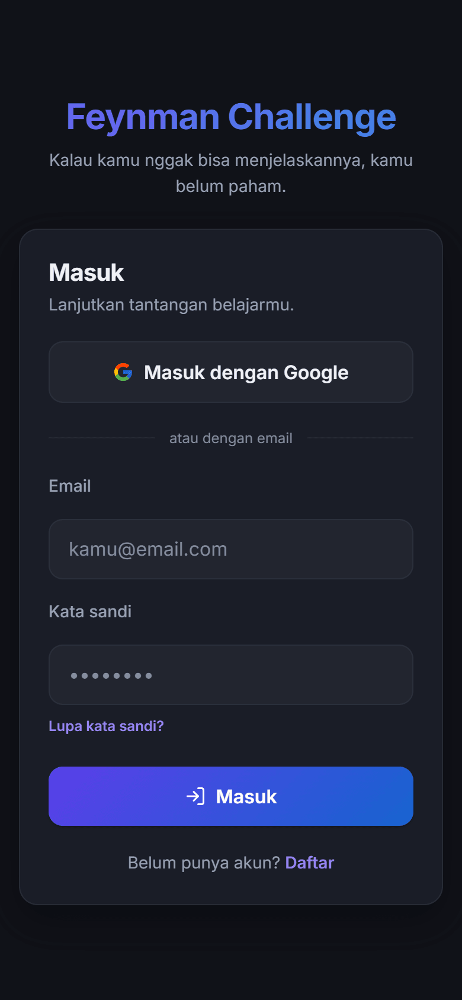
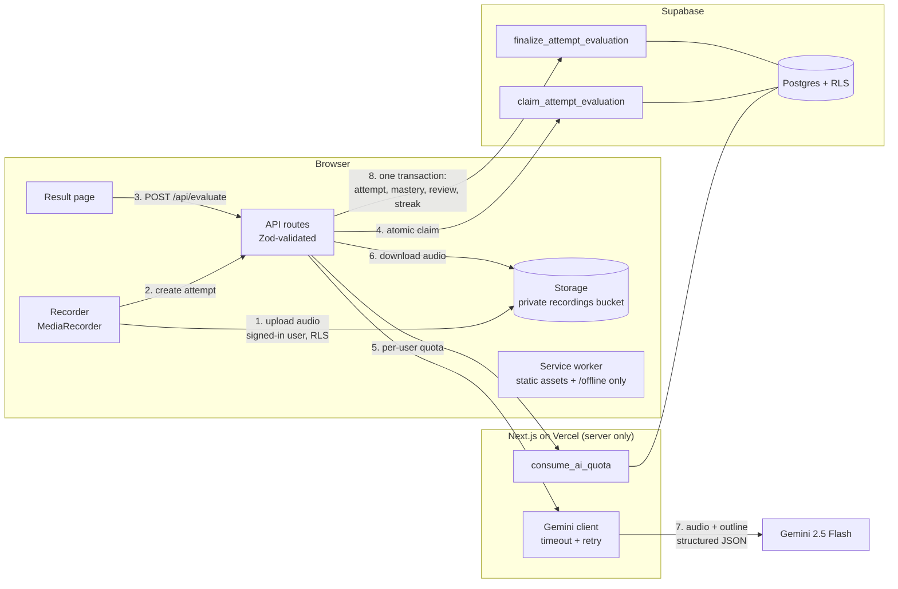

# 🧠 Feynman Challenge

> _"Kalau kamu nggak bisa menjelaskannya, kamu belum paham."_
> A PWA that helps self-learners master any topic with the **Feynman Technique**: explain it out loud, and let AI tell you exactly which parts you really understood.

<p align="center">
  
</p>

**Try it without an account:** the sign-in page has a **"Coba tanpa akun"** button (demo mode) that opens a fully worked example challenge, including an evaluated attempt, without spending any AI quota.

---

## ✨ What it does

You pick a topic. AI drafts a learning outline and sources. You study, then **record yourself explaining it**. The recording goes straight to Gemini (multimodal audio), which transcribes it and grades it against your outline: comprehensiveness, accuracy, and clarity, with per-point coverage and quotes from what you actually said. Then the app tells you what to study next and when to come back.

### Features

- **AI learning plans**: outline, suggested sources, and a recording length sized to the topic.
- **Notebook**: editable outline (drag or arrows), sources, and markdown notes with autosave and preview. Each outline point shows a **coverage trend** of your last 5 attempts.
- **Immersive recording**: countdown, live waveform, pause/resume, listen-before-send, and **tiered hints** generated per outline point that cap the maximum score (none 10, keywords 9, guiding questions 8, outline 7).
- **Trustworthy evaluation**: one Gemini call returns transcript, sub-scores, one coverage verdict per outline point with a quote as evidence, and unexplained jargon. The overall score is computed on the server. Unusable audio (silence, noise, wrong language) is rejected without a score.
- **Close the gap**: every partial or missing point has **"Pelajari lagi"**, which opens the notebook at that point. The result page compares each point with your previous attempt: improved, declined, still weak.
- **Socratic coach**: 1–2 follow-up questions aimed at your weakest point, answered by voice and graded (tepat / sebagian / keliru). Answers never change your score.
- **Spaced repetition**: Leitner boxes (1, 3, 7, 14, 30, 60 days) decide when each topic comes back. Mastery climbs `not_started → attempted → developing → proficient → mastered → solidified` and slips a level if a review is badly overdue.
- **Gentle accountability**: deadlines are calendar days in your timezone, missed ones auto-extend once, and streaks count real completed evaluations.
- **Demo mode**: anonymous sign-in with a seeded example, stricter AI quota, and a one-step path to keep the account (link an email, then set a password).
- **Installable PWA**: maskable icons, shortcuts, an offline page, and a service worker that never caches private pages.

---

## 🏗️ Architecture



- **Server-first**: pages are React Server Components reading through a per-request Supabase client. Interactivity lives in small `"use client"` islands.
- **Security**: `GEMINI_API_KEY` and the service-role key are server-only (`src/lib/env.ts`). Every table has Row Level Security. Model output is validated with Zod, and user text inside prompts is fenced against prompt injection.
- **Middleware**: refreshes the session, guards private routes, and only allows same-origin `?next=` redirects.

```
src/
├── app/
│   ├── (auth)/                 # login, signup, password reset
│   ├── (app)/                  # dashboard, notebook, results, settings
│   ├── challenge/[id]/record/  # full-screen recorder
│   ├── offline/                # service-worker fallback (static, no user data)
│   └── api/                    # challenge CRUD, generate, evaluate, follow-ups, demo seed
├── components/                 # ui, layout, auth, challenge, recording, evaluation, dashboard
├── lib/                        # supabase/, gemini/, ai/, auth/, demo/, pwa/, storage/, utils/
├── styles/                     # design tokens + feature stylesheets (vanilla CSS)
└── types/                      # Database types + shared domain types
```

---

## 🧭 Technical decisions

| Decision | Why |
|---|---|
| **Gemini multimodal instead of a separate speech-to-text service** | One request returns transcript and grading together. It hears hesitation and self-corrections, handles Indonesian well, and costs nothing on the free tier. |
| **Direct browser upload to Storage** | The audio never passes through a serverless function, so there is no 4.5 MB body limit and no double transfer. The API only receives a path it verifies belongs to the user. |
| **Transactional RPCs for evaluation** | `claim_attempt_evaluation` prevents double evaluation from retries or two tabs. `finalize_attempt_evaluation` writes the attempt, mastery, review schedule, and streak in one transaction, so a crash can never leave them out of sync. |
| **Score computed on the server** | Gemini returns sub-scores only. The weighted overall score and the hint cap are applied in code (`src/lib/utils/scoring.ts`), so the model cannot drift the formula. |
| **Deadlines as calendar days + user timezone** | "Today" is always computed in the learner's IANA timezone. Auto-extension and streak display are derived at read time instead of being stored and going stale. |
| **Spaced repetition over time decay** | Leitner boxes schedule the next review from performance. Early reviews do not earn promotions, so "solidified" really means spaced, successful recall. |
| **Quota in SQL** | `consume_ai_quota` counts calls atomically, so concurrent requests cannot slip past the limit. Anonymous demo accounts get tighter limits. |
| **Network-only navigations in the service worker** | Authenticated HTML is never cached, so a shared device cannot show a previous user's data offline. Caches are versioned per build and wiped on logout. |

---

## 🚀 Getting started

### 1. Prerequisites
- Node.js 20+
- A [Supabase](https://supabase.com) project (free tier is enough)
- A [Gemini API key](https://aistudio.google.com/app/apikey)

### 2. Install
```bash
npm install
```

### 3. Environment
Copy `.env.local.example` to `.env.local` and fill in:
```bash
NEXT_PUBLIC_SUPABASE_URL=...
NEXT_PUBLIC_SUPABASE_ANON_KEY=...
SUPABASE_SERVICE_ROLE_KEY=...      # server-only
GEMINI_API_KEY=...                 # server-only
```

### 4. Database
In the Supabase SQL Editor, run every migration **in order**. Each one is idempotent.

| Migration | Adds |
|---|---|
| `001_initial_schema.sql` | 6 core tables, RLS policies, profile and `updated_at` triggers |
| `002_storage.sql` | Private `recordings` bucket and storage policies |
| `003_pipeline.sql` | Bucket limits, atomic evaluation claim/finalize, per-user AI quota |
| `004_time_and_state.sql` | User timezone, `deadline` as a date, `last_attempt_at` |
| `005_ai_quality.sql` | AI hints per outline point, unexplained jargon, unscorable-audio handling |
| `006_learning_loop.sql` | Spaced repetition (`review_box`, `next_review_at`), follow-up questions and answers |

### 5. Authentication (Supabase dashboard)
- **Redirect URLs** (Authentication > URL Configuration): add `http://localhost:3000/api/auth/callback` and `https://<your-domain>/api/auth/callback`. Email confirmation, password recovery, OAuth, and the demo-account email link all land there.
- **Minimum password length** (Authentication > Providers > Email): set it to **8**, matching `src/lib/auth/password.ts`.
- **Google sign-in (optional)**:
  1. Google Cloud Console > APIs & Services > Credentials > *Create OAuth client ID* (type *Web application*).
  2. Authorized redirect URI: `https://<your-project-ref>.supabase.co/auth/v1/callback`.
  3. Supabase > Authentication > Providers > Google: enable it and paste the client ID and secret.
- **Demo mode (optional)**: Authentication > Sign In / Providers > enable **Allow anonymous sign-ins**. Turning on CAPTCHA protection is recommended, because anonymous accounts can be created without an email.

The sign-in and sign-up pages read these switches from Supabase and hide the Google and "Coba tanpa akun" buttons while they are off (cached for five minutes).

### 6. Run
```bash
npm run dev      # http://localhost:3000
```

---

## ✅ Testing and verification

```bash
npx tsc --noEmit        # type check (strict, zero any)
npm run lint            # ESLint
npm run format:check    # Prettier
npm test                # Vitest: every pure module in src/lib has tests beside it
npm run build           # production build
```

The same checks run in CI on every push (`.github/workflows/ci.yml`). The service worker is registered only in production builds, so test PWA behaviour with `npm run build && npm start`.

To regenerate the app icons after changing the mark: `npm run icons`.

### Screen gallery (design work)

In development, `/dev/galeri` renders every screen and state (dashboard, notebook, recording, results, settings, dialogs) with fixed sample data, without Supabase. It returns 404 in production builds.

```bash
npm run dev                          # terminal 1
npm run shots -- --label before      # terminal 2: docs/design/shots/before/*.png at 390 and 1280 px
```

Design rules live in [`docs/design/DESIGN.md`](docs/design/DESIGN.md), and the latest audit in [`docs/design/audit.md`](docs/design/audit.md).

### Lighthouse

Measured on the public sign-in page against a local production build (`npm start`), Lighthouse 12:

| | Performance | Accessibility | Best Practices | SEO |
|---|---|---|---|---|
| Mobile | 94 | 100 | 100 | 90 |
| Desktop | 100 | 100 | 100 | 90 |

The SEO point is lost because Next.js 15 streams `<title>` and `<meta name="description">` into the body for clients it does not recognise as crawlers, and Lighthouse 12 no longer identifies itself as one. Pages behind sign-in were not measured.

---

## 🗺️ Roadmap

The improvement plan that produced v1.0 lives in [`prompts/improvement-plan.md`](prompts/improvement-plan.md), with a backlog at the end: end-to-end tests, error monitoring, account deletion, offline recording, and push reminders. See [`CHANGELOG.md`](CHANGELOG.md) for what changed.

---

## 📄 License

MIT. Built as a portfolio project.
