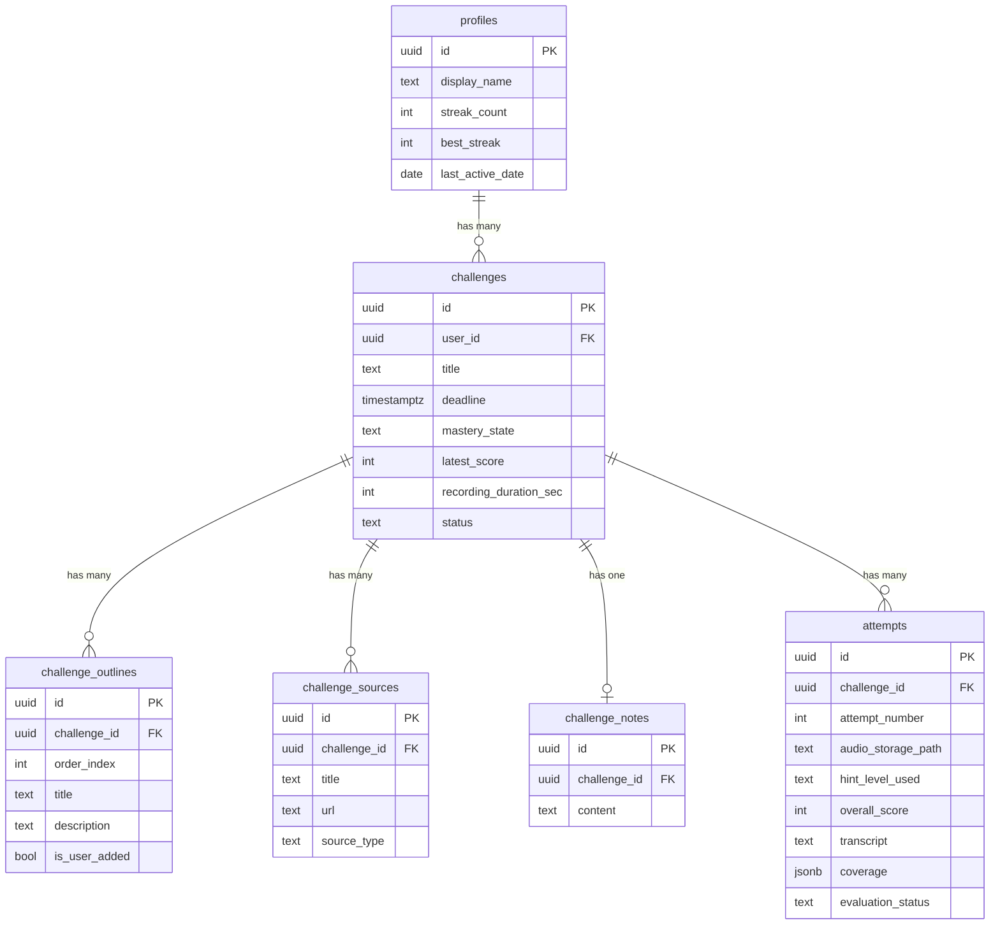

# 🧠 Feynman Challenge — Master Project Document

> Dokumen ini menggabungkan seluruh hasil brainstorming, analisis teknis, cost analysis, dan implementation plan menjadi satu referensi komprehensif untuk eksekusi.

---

## 1. Product Identity

| Aspek | Detail |
|---|---|
| **Nama kerja** | *Feynman Challenge* (bisa ganti nanti) |
| **Tagline** | "Kalau kamu nggak bisa menjelaskannya, kamu belum paham." |
| **Target user** | Self-learner / autodidact |
| **Tujuan utama** | Membantu user menguasai materi apapun lewat tantangan menjelaskan ulang (Feynman Technique) |
| **Konteks project** | Portfolio piece + personal experiment |

---

## 2. Platform: Progressive Web App (PWA)

### Kenapa PWA?

```
                    Web App Biasa    PWA ✅         Native Mobile
                    ─────────────    ──────         ─────────────
Akses microphone    ✅               ✅              ✅
Bisa di-install     ❌               ✅              ✅
Offline capable     ❌               ✅              ✅
Satu codebase       ✅               ✅              ❌
Desktop + Mobile    ✅               ✅              ❌
App store needed    ❌               ❌              ✅
Effort level        Rendah           Sedang          Tinggi
Portfolio impact    Sedang           Tinggi          Tinggi
```

**PWA = sweet spot** untuk kebutuhan project ini:
- **Fleksibel**: Bisa dibuka di browser desktop (enak buat nulis notebook) DAN di mobile (enak buat recording on-the-go)
- **Installable**: User bisa "install" ke home screen HP tanpa app store
- **Modern**: Menunjukkan skill modern web development di portfolio
- **Microphone/Camera API**: Fully supported di PWA

---

## 3. Speech-to-Text Strategy — Deep Dive & Keputusan Final

### Kenapa Ini Krusial

Alur core app:

```
User rekam audio → ??? → AI evaluate → Skor + Feedback
                   ↑
            Bagian ini yang dibahas
```

Ada **2 pendekatan fundamental** yang berbeda secara arsitektur:

```
Pendekatan A: Audio → [STT] → Teks → [LLM] → Evaluasi
                       ↑                ↑
                   2 langkah, 2 service

Pendekatan B: Audio → [LLM Multimodal] → Evaluasi
                            ↑
                    1 langkah, 1 service
```

---

### Opsi 1: Web Speech API ❌ Tidak Direkomendasikan

```
Browser mic → Web Speech API → Teks (real-time) → Gemini → Evaluasi
```

| Aspek | Detail |
|---|---|
| **Cara kerja** | Browser mengirim audio ke server Google/OS secara real-time, return teks |
| **Harga** | Gratis |
| **Kelebihan** | Zero setup, browser-native |

#### Kenapa TIDAK cocok:

1. **Designed untuk live dictation, bukan post-recording analysis**
   - Web Speech API bekerja secara *streaming* saat user bicara
   - Kita butuh: rekam dulu → simpan → baru proses
   - Untuk "memutar ulang" audio ke Web Speech API itu hacky dan unreliable

2. **Browser support tidak konsisten**
   - Hanya benar-benar reliable di Chrome (yang pakai Google's server)
   - Firefox, Safari: partial atau tidak support
   - Untuk app profesional, ini dealbreaker

3. **Akurasi bahasa Indonesia campur Inggris rendah**
   - Web Speech API butuh ditetapkan 1 bahasa
   - Self-learner sering campur: "Jadi gradient descent itu basically turunan dari loss function..."
   - Hasilnya? Kacau.

4. **Tidak bisa diproses ulang**
   - Kalau user mau lihat transkrip-nya nanti, kita tidak punya audio yang bisa di-retranscribe
   - Tidak ada retry mechanism di sisi transcription

5. **Privacy concern**
   - Di Chrome, audio dikirim ke server Google tanpa kontrol kita
   - Tidak profesional untuk app yang published

> **Verdict**: Web Speech API bagus untuk prototype/demo, tapi **tidak layak untuk production app** yang mau di-publish.

---

### Opsi 2: Dedicated STT Service ⚠️ Bisa, Tapi Over-engineered

```
Audio file → [Whisper/Deepgram] → Teks → [Gemini] → Evaluasi
```

| Service | Free Tier | Akurasi Indo | Multilingual |
|---|---|---|---|
| **OpenAI Whisper API** | Tidak gratis ($0.006/min) | Sangat bagus | ✅ |
| **Deepgram** | $200 credit free | Bagus | ✅ |
| **AssemblyAI** | 100 hrs/bulan free | Cukup | ✅ |
| **Whisper local** (self-hosted) | Gratis | Sangat bagus | ✅ |

#### Pro:
- Akurasi tinggi (terutama Whisper)
- Transkrip bisa disimpan & ditampilkan ke user
- Modular — bisa ganti STT service tanpa ubah evaluator

#### Kontra:
- **2 API calls** per recording (STT + LLM) — lebih lambat, lebih banyak failure point
- **Error propagation** — kalau STT salah transkrip, evaluasi LLM ikut salah
- **Tambah dependency** — satu lagi service yang harus di-maintain
- Kalau pakai yang berbayar, ada cost

---

### Opsi 3: Gemini Multimodal (Direct Audio) ✅ RECOMMENDED

```
Audio file → [Gemini API - audio + prompt] → Transkrip + Evaluasi (sekaligus!)
```

#### Bagaimana ini bekerja:

Gemini 2.0 Flash (yang free tier) bisa menerima **audio sebagai input langsung** — bukan cuma teks. Jadi kita bisa kirim:

```
Input ke Gemini:
├── 🎵 Audio file (rekaman user)
├── 📋 Learning outline (rubrik)
└── 📝 Prompt: "Transkrip audio ini, lalu evaluasi berdasarkan outline"

Output dari Gemini:
├── 📝 Transcript (hasil transkripsi)
├── 📊 Scores (comprehensiveness, accuracy, clarity)
├── 💬 Feedback (penjelasan detail)
└── 📋 Coverage (checklist mana yang tercakup)
```

#### Kenapa ini SUPERIOR:

| Aspek | Detail |
|---|---|
| **Single API call** | 1 request = transkrip + evaluasi. Lebih cepat, lebih reliable. |
| **Konteks audio penuh** | Gemini "dengar" langsung — bisa tangkap *intonasi*, *confidence*, *hesitation*. STT terpisah kehilangan nuansa ini. |
| **Tidak ada error propagation** | Tidak ada risiko STT salah transkrip → evaluasi ikut salah. Gemini interpret langsung dari audio. |
| **Bahasa campur** | Gemini handle code-switching (Indo ↔ English) jauh lebih baik karena dia understand context, bukan cuma phonetics. |
| **Gratis** | Gemini free tier support audio input. 1500 req/hari. |
| **Arsitektur clean** | Satu dependency, satu API, satu error handling path. |
| **Structured output** | Gemini bisa return JSON terstruktur — langsung parseable. |

#### Arsitektur Flow:

```
┌─────────────────────────────────────────────────────────┐
│                      CLIENT (Browser)                   │
│                                                         │
│  MediaRecorder API                                      │
│  ├── Rekam audio (WebM/MP3)                            │
│  ├── Simpan sebagai Blob                               │
│  └── Upload ke server                                   │
│                                                         │
└────────────────────┬────────────────────────────────────┘
                     │ POST /api/evaluate
                     ▼
┌─────────────────────────────────────────────────────────┐
│                   SERVER (Next.js API Route)            │
│                                                         │
│  1. Terima audio file                                   │
│  2. Ambil outline + notes dari Supabase                 │
│  3. Compose prompt:                                     │
│     ┌─────────────────────────────────────────────┐     │
│     │ System: "Kamu adalah evaluator Feynman.     │     │
│     │ Evaluasi audio ini berdasarkan outline.      │     │
│     │ Return JSON: {transcript, scores, feedback}" │     │
│     │                                              │     │
│     │ Attachments:                                 │     │
│     │ - audio_file.webm                            │     │
│     │ - outline: [...]                             │     │
│     │ - user_notes: "..."                          │     │
│     └─────────────────────────────────────────────┘     │
│  4. Send to Gemini API (multimodal)                     │
│  5. Parse structured response                           │
│  6. Save evaluation to Supabase                         │
│  7. Return result to client                             │
│                                                         │
└─────────────────────────────────────────────────────────┘
```

#### Contoh Prompt ke Gemini (Evaluation):

```
Kamu adalah evaluator untuk Feynman Learning Challenge.

TUGAS:
1. Transkrip audio yang diberikan
2. Evaluasi penjelasan user berdasarkan learning outline di bawah
3. Berikan skor dan feedback

LEARNING OUTLINE:
1. Apa itu Quantum Entanglement
2. Eksperimen Bell dan signifikansinya
3. Bukan komunikasi lebih cepat dari cahaya
4. Aplikasi nyata (quantum computing, dll)

USER NOTES:
[catatan user kalau ada]

HINT LEVEL USED: Keywords (max score: 9)

FORMAT OUTPUT (JSON):
{
  "transcript": "...",
  "overall_score": 7,
  "sub_scores": {
    "comprehensiveness": 6,
    "accuracy": 8,
    "clarity": 7
  },
  "coverage": [
    {"topic": "Apa itu QE", "status": "covered", "note": "Dijelaskan dengan baik"},
    {"topic": "Eksperimen Bell", "status": "partial", "note": "Disebutkan tapi kurang detail"},
    {"topic": "Bukan FTL", "status": "missing", "note": "Tidak dibahas"},
    {"topic": "Aplikasi nyata", "status": "missing", "note": "Tidak dibahas"}
  ],
  "feedback": "...",
  "strengths": ["...", "..."],
  "improvements": ["...", "..."]
}
```

#### Edge Case: Bagaimana Kalau User Mau Lihat Transkrip?

Dengan pendekatan ini, Gemini **juga menghasilkan transkrip** sebagai bagian dari output. Jadi kita tetap bisa:
- Tampilkan transkrip ke user di halaman hasil
- Simpan transkrip di database
- User bisa review apa yang mereka katakan

#### Perbandingan Final STT Options:

| Kriteria | Web Speech API | Dedicated STT + LLM | Gemini Multimodal ✅ |
|---|---|---|---|
| API calls per recording | 1 (tapi hacky) | 2 | **1** |
| Akurasi Indo campur Inggris | Rendah | Tinggi | **Tinggi** |
| Dapat transkrip | Ya | Ya | **Ya** |
| Tangkap nuansa audio | Tidak | Tidak | **Ya** (intonasi, hesitation) |
| Arsitektur | Hacky | Clean tapi kompleks | **Clean & simple** |
| Biaya | Gratis | Bervariasi | **Gratis** |
| Reliability | Rendah | Tinggi | **Tinggi** |
| Browser support | Chrome only | Universal | **Universal** |
| Professional grade | ❌ | ✅ | **✅** |

> **Rekomendasi final: Gemini Multimodal (Direct Audio Processing)**
> Single API call, arsitektur paling clean, gratis, dan secara teknis paling superior karena AI punya akses ke audio asli — bukan terjemahan teks yang sudah lossy.

---

## 4. Tech Stack Final

| Layer | Technology | Rationale |
|---|---|---|
| **Framework** | Next.js 15 (App Router) | SSR, API Routes, RSC, portfolio-grade |
| **Language** | TypeScript (strict) | Type safety, zero `any` |
| **Database** | Supabase (PostgreSQL) | Free tier, auth, storage, RLS |
| **Auth** | Supabase Auth | Email/password, OAuth-ready |
| **AI** | Gemini 2.0 Flash (free tier) | Multimodal audio processing + evaluation + outline generation |
| **Audio Recording** | MediaRecorder API | Browser-native, no dependency |
| **Audio Storage** | Supabase Storage | Integrated with DB, free 1GB |
| **Validation** | Zod | Runtime type checking for API I/O |
| **Styling** | Vanilla CSS (custom properties) | Full control, premium design |
| **Font** | Inter (Google Fonts) | Modern, clean, highly readable |
| **Hosting** | Vercel | Free tier, auto-deploy |
| **PWA** | Custom service worker | Installable, offline-capable |

### Standar Arsitektur Profesional

Karena ini project yang akan di-publish, ini standar arsitektur yang diterapkan:

| Aspek | Standar |
|---|---|
| **Language** | TypeScript strict mode — zero `any` |
| **API Keys** | Server-side only via Next.js API Routes — never exposed to client |
| **Database** | Supabase with Row Level Security (RLS) — proper auth |
| **Auth** | Supabase Auth (email/password atau OAuth) |
| **State Management** | React Server Components + minimal client state |
| **Error Handling** | Proper error boundaries, loading states, retry logic |
| **File Structure** | Feature-based modular structure |
| **Validation** | Zod schemas for API request/response validation |
| **Code Quality** | ESLint + Prettier |
| **Git** | Conventional commits, clean history |
| **Environment** | `.env.local` for secrets, proper env validation |

---

## 5. Cost & Feasibility Analysis

### TL;DR

| Service | Biaya | Status |
|---|---|---|
| Next.js | Open source | ✅ Gratis |
| Vercel (hosting) | Free tier | ✅ Gratis |
| Supabase (DB + auth + storage) | Free tier | ✅ Gratis |
| Gemini API (AI) | Free tier | ✅ Gratis |
| MediaRecorder API | Browser built-in | ✅ Gratis |
| Web Audio API (waveform) | Browser built-in | ✅ Gratis |
| Google Fonts (Inter) | Free | ✅ Gratis |
| Domain (opsional) | Nggak perlu | ✅ Gratis |
| **TOTAL** | | **🎉 $0/bulan** |

---

### Breakdown Detail per Service

#### 1. Vercel (Hosting) — ✅ Aman

| Resource | Free Tier Limit | Estimasi Kita | Headroom |
|---|---|---|---|
| Bandwidth | 100 GB/bulan | ~1-2 GB | 50-100x lipat |
| Serverless Function | 100 GB-Hours/bulan | ~0.5 GB-Hours | 200x lipat |
| Function Duration | Maks 60 detik | ~15-30 detik (evaluasi) | ✅ Cukup |
| Builds | 6000 menit/bulan | ~50 menit | 120x lipat |
| Projects | Unlimited | 1 | ✅ |

> ⚠️ **Perlu diperhatikan**: Serverless function default timeout = 10 detik. Kita perlu set `maxDuration: 60` di API route evaluasi karena Gemini processing audio bisa 15-30 detik. **Ini supported di free tier**, cuma perlu dikonfigurasi.

---

#### 2. Supabase — ✅ Aman (dengan 1 catatan)

| Resource | Free Tier Limit | Estimasi Kita | Headroom |
|---|---|---|---|
| Database | 500 MB | ~10-50 MB | 10-50x lipat |
| Storage (audio files) | 1 GB | ~300-500 MB (ratusan rekaman) | 2-3x lipat |
| Auth users | 50,000 MAU | 1 (kamu aja) | 50,000x lipat 😂 |
| API requests | Unlimited | Ratusan/hari | ✅ |
| Realtime connections | 200 concurrent | 1-2 | ✅ |
| Edge Functions | 500K/bulan | ~100/bulan | 5,000x lipat |
| Projects | 2 | 1 | ✅ |

**Kalkulasi storage audio:**

```
Asumsi per rekaman:
• Format: WebM (Opus codec)
• Durasi: ~3 menit
• Ukuran: ~500 KB - 1.5 MB

Dengan 1 GB storage:
• Estimasi: 650-2000 rekaman
• Kalau rekam 3x/hari: cukup untuk 7-22 bulan

→ Sangat cukup untuk personal use
```

> ⚠️ **1 Catatan**: Supabase free tier akan **pause project setelah 7 hari tidak aktif**. Project bisa di-resume kapan saja (butuh ~1 menit), tapi kalau kamu nggak buka app selama seminggu, pas buka pertama kali akan ada delay singkat.
>
> **Mitigasi**: Karena ini app belajar harian, kemungkinan besar kamu akan pakai minimal beberapa kali seminggu — jadi ini seharusnya bukan masalah.

---

#### 3. Gemini API — ✅ Aman

| Resource | Free Tier Limit | Estimasi Kita | Headroom |
|---|---|---|---|
| Requests/hari | 1,500 | ~5-20 | 75-300x lipat |
| Requests/menit | 15 | 1-2 | 7-15x lipat |
| Tokens/menit | 1,000,000 | ~5,000-10,000 | 100-200x lipat |
| Audio input | ✅ Supported | ✅ | ✅ |
| Structured output (JSON) | ✅ Supported | ✅ | ✅ |

**Kalkulasi request harian (worst case aktif banget):**

```
Skenario: Hari yang sangat produktif
• 3 challenge baru (generate outline)     = 3 requests
• 5 recording + evaluasi                  = 5 requests
• Beberapa retry                          = 3 requests
                                          ──────────────
                                Total     = 11 requests

Free tier: 1,500/hari
Headroom: 136x lipat ✅
```

**Audio processing support:**
- Gemini 2.0 Flash mendukung audio input secara native
- Format yang didukung: WAV, MP3, AIFF, AAC, OGG, FLAC, WebM ← **WebM** yang dihasilkan MediaRecorder
- Maks audio duration: 9.5 jam per request ← rekaman kita cuma 1-5 menit
- Maks file size: 20 MB per request ← file kita ~0.5-1.5 MB

---

#### 4. Browser APIs — ✅ Zero Cost

| API | Browser Support | Notes |
|---|---|---|
| **MediaRecorder** | Chrome ✅ Firefox ✅ Safari ✅ Edge ✅ | Output format: WebM (Chrome/Firefox/Edge), MP4 (Safari) |
| **Web Audio API** (waveform) | Chrome ✅ Firefox ✅ Safari ✅ Edge ✅ | Untuk AnalyserNode visualisasi |
| **getUserMedia** (mic access) | Chrome ✅ Firefox ✅ Safari ✅ Edge ✅ | Perlu HTTPS (Vercel otomatis HTTPS) |

---

### Feasibility Risk Assessment

#### Risk 1: Vercel Serverless Timeout ⚠️ LOW

| | |
|---|---|
| **Risiko** | Evaluasi Gemini dengan audio melebihi timeout |
| **Probabilitas** | Rendah |
| **Impact** | Evaluasi gagal, user harus retry |
| **Mitigasi** | Set `maxDuration: 60` di route config. Gemini Flash biasanya respond dalam 10-20 detik untuk audio pendek. Tambah retry logic di client. |
| **Status** | ✅ Manageable |

#### Risk 2: Supabase Auto-Pause ⚠️ LOW

| | |
|---|---|
| **Risiko** | Project pause setelah 7 hari inaktif |
| **Probabilitas** | Rendah (app ini untuk dipakai rutin) |
| **Impact** | Cold start ~1 menit saat resume |
| **Mitigasi** | Kalau jadi masalah, bisa setup cron ping sederhana (tapi seharusnya nggak perlu). |
| **Status** | ✅ Acceptable |

#### Risk 3: Gemini Audio Evaluation Quality ⚠️ LOW-MEDIUM

| | |
|---|---|
| **Risiko** | Gemini kurang akurat menilai penjelasan, terutama bahasa Indonesia |
| **Probabilitas** | Rendah-Sedang |
| **Impact** | Skor kurang reliable |
| **Mitigasi** | Prompt engineering yang baik (rubrik detail, contoh output). Gemini 2.0 Flash performanya bagus untuk bahasa Indonesia. Bisa iterasi prompt berdasarkan hasil. |
| **Status** | ✅ Manageable (butuh tuning prompt) |

#### Risk 4: Storage Limit Tercapai ⚠️ VERY LOW

| | |
|---|---|
| **Risiko** | 1 GB storage Supabase habis |
| **Probabilitas** | Sangat rendah (butuh ratusan rekaman) |
| **Impact** | Nggak bisa upload rekaman baru |
| **Mitigasi** | Opsi: hapus rekaman lama yang sudah Solidified, compress audio, atau upgrade ke Supabase Pro ($25/bulan) kalau project sudah proven. |
| **Status** | ✅ Nggak perlu dipikirkan sekarang |

### Verdict

```
┌──────────────────────────────────────────────┐
│                                              │
│   💰 Total biaya: $0 / bulan                │
│                                              │
│   ✅ Semua service: 100% free tier           │
│   ✅ Semua free tier: headroom besar         │
│   ✅ Semua API: browser-supported            │
│   ✅ Risiko: semua manageable                │
│                                              │
│   🟢 FEASIBLE — Aman untuk dieksekusi       │
│                                              │
└──────────────────────────────────────────────┘
```

---

## 6. Core Features — Final Design

### 6.1 📓 Notebook (Challenge Hub)

```
┌────────────────────────────────────────────────────────────┐
│  ➕ New Challenge                                          │
│                                                            │
│  "Aku mau belajar tentang: [___________________]"          │
│                                                            │
│  ⏰ Deadline: [📅 Pilih tanggal]                           │
│                                                            │
│  [🚀 Generate Learning Plan]                               │
│                                                            │
├────────────────────────────────────────────────────────────┤
│                                                            │
│  🤖 AI Generated:                                         │
│                                                            │
│  📋 Learning Outline                    [✏️ Edit]          │
│  ├── 1. Apa itu X?                                        │
│  ├── 2. Konsep kunci A, B, C                              │
│  ├── 3. Hubungan X dengan Y                               │
│  └── 4. Aplikasi & contoh nyata                           │
│                                                            │
│  📚 Sumber Belajar                      [➕ Tambah]        │
│  ├── 🎥 "Video Title" — YouTube                           │
│  ├── 📄 "Article Title" — Domain                          │
│  └── 📖 "Book Title" — Chapter X                          │
│                                                            │
│  ✏️ My Notes                                              │
│  └── (Area catatan pribadi, markdown supported)            │
│                                                            │
│  ⏱️ Estimated Duration: 3 menit (sedang)                  │
│                                                            │
└────────────────────────────────────────────────────────────┘
```

**Key decisions:**
- User BISA edit outline (hapus/tambah poin) → ini jadi rubrik penilaian
- Notes user = konteks tambahan untuk AI, BUKAN bagian rubrik wajib
- AI tentukan durasi recording berdasarkan kompleksitas outline

---

### 6.2 🎙️ Recording Challenge

```
┌────────────────────────────────────────────────────────────┐
│                                                            │
│  📚 Quantum Entanglement                                  │
│  ⏱️ 02:47 remaining              ● Recording...          │
│                                                            │
│  ┌──────────────────────────────────────────────────────┐  │
│  │                                                      │  │
│  │              🎤 waveform visualizer                  │  │
│  │         ╱╲  ╱╲╱╲  ╱╲   ╱╲╱╲╱╲  ╱╲                  │  │
│  │        ╱  ╲╱    ╲╱  ╲ ╱       ╲╱  ╲                 │  │
│  │                                                      │  │
│  └──────────────────────────────────────────────────────┘  │
│                                                            │
│  💡 Butuh bantuan?                                        │
│  ┌──────────────────────────────────────────────────────┐  │
│  │  🟠 Keywords           (maks skor: 9)               │  │
│  │  🟡 Guiding Questions  (maks skor: 8)               │  │
│  │  🟢 Outline            (maks skor: 7)               │  │
│  │  ──────────────────────────────────                  │  │
│  │  ⚡ Tanpa hint        = maks skor: 10               │  │
│  └──────────────────────────────────────────────────────┘  │
│                                                            │
│           [⏸️ Pause]    [🔴 Stop & Submit]                │
│                                                            │
└────────────────────────────────────────────────────────────┘
```

**Key decisions:**
- Tiered hints dengan score cap
- Timer tetap jalan saat hint terbuka
- Hint yang sudah dibuka = skor maks terkunci
- Durasi adaptive berdasarkan outline complexity

---

### 6.3 📊 AI Evaluation

```
┌────────────────────────────────────────────────────────────┐
│                                                            │
│  📊 Evaluation Results — Attempt #2                       │
│                                                            │
│  ┌─────────────────────────────────┐                      │
│  │         Overall Score           │                      │
│  │                                 │                      │
│  │            7 / 10               │                      │
│  │         ████████░░░             │                      │
│  │                                 │                      │
│  │    Previous: 5/10 → 7/10 📈    │                      │
│  └─────────────────────────────────┘                      │
│                                                            │
│  📋 Coverage Analysis                                     │
│  ├── ✅ Apa itu entanglement       — Tercakup dengan baik │
│  ├── ✅ Eksperimen Bell            — Disebutkan, akurat   │
│  ├── ⚠️ Bukan komunikasi FTL     — Disebutkan tapi      │
│  │      penjelasan kurang tepat                           │
│  └── ❌ Aplikasi & contoh nyata   — Belum dibahas        │
│                                                            │
│  📝 AI Feedback                                           │
│  "Penjelasanmu tentang konsep dasar sudah bagus!          │
│   Analogi 'sarung tangan' itu tepat. Tapi kamu perlu     │
│   klarifikasi bahwa entanglement BUKAN mengirim sinyal    │
│   lebih cepat dari cahaya. Juga, coba bahas minimal      │
│   1 aplikasi nyata di attempt berikutnya."                │
│                                                            │
│  🔍 Sub-Scores                                            │
│  ├── Comprehensiveness:  6/10  (1 topik belum tercakup)   │
│  ├── Accuracy:           8/10  (1 misconception minor)    │
│  └── Clarity:            7/10  (penjelasan cukup jelas)   │
│                                                            │
│  [🔄 Try Again]  [📓 Back to Notebook]                    │
│                                                            │
└────────────────────────────────────────────────────────────┘
```

**Rubrik penilaian AI** (yang dikirim ke Gemini sebagai prompt):
- **Comprehensiveness** (40%) — Berapa persen outline yang tercakup?
- **Accuracy** (35%) — Apakah penjelasan sesuai dengan sumber/konsep yang benar?
- **Clarity** (25%) — Apakah penjelasan bisa dipahami orang awam? (Feynman test)

---

### 6.4 🏠 Dashboard

```
┌────────────────────────────────────────────────────────────┐
│                                                            │
│  👋 Welcome back!                  🔥 Streak: 12 hari     │
│                                                            │
│  ⚡ Due Soon                                              │
│  ┌──────────────────────────────────────────────────────┐  │
│  │  🟠 Quantum Entanglement      ⏰ 2 hari lagi       │  │
│  │  🟡 Neural Networks           ⏰ 5 hari lagi       │  │
│  └──────────────────────────────────────────────────────┘  │
│                                                            │
│  🍂 Perlu Review (Mastery Decay)                          │
│  ┌──────────────────────────────────────────────────────┐  │
│  │  🟧 Gradient Descent          30 hari sejak review  │  │
│  └──────────────────────────────────────────────────────┘  │
│                                                            │
│  📊 All Challenges                                        │
│  ┌──────────────────────────────────────────────────────┐  │
│  │  🟦 CSS Grid Layout          Solidified    9/10     │  │
│  │  🟩 React Hooks              Mastered      8/10     │  │
│  │  🟧 Gradient Descent         Developing    6/10     │  │
│  │  🟠 Quantum Entanglement     Attempted     5/10     │  │
│  │  ⬛ Neural Networks           Not Started    —       │  │
│  └──────────────────────────────────────────────────────┘  │
│                                                            │
│  [➕ New Challenge]                                        │
│                                                            │
└────────────────────────────────────────────────────────────┘
```

---

### 6.5 ⏰ Deadline System (Gentle Accountability)

| Event | Response | Tone |
|---|---|---|
| 3 hari sebelum | Reminder | "3 hari lagi ⏰" |
| 1 hari sebelum | Highlight | "Besok! Sudah siap? 🎙️" |
| Hari H | Prominent banner | "Hari ini! Kamu pasti bisa 💪" |
| Terlewat | Auto-extend +2 hari | "Nggak apa-apa, waktu ditambah!" |
| Extend terlewat | Tanya user | "Mau reschedule atau istirahat dulu?" |

---

### 6.6 Mastery System

```
⬛ Not Started
    ↓  (submit pertama)
🟥 Attempted
    ↓  (skor ≥ 5)
🟧 Developing
    ↓  (skor ≥ 7)
🟨 Proficient
    ↓  (skor ≥ 8, 2x berturut)
🟩 Mastered
    ↓  (skor ≥ 8 dan review box ≥ 4)
🟦 Solidified
```

**Spaced repetition (menggantikan decay 30 hari).** Setiap tantangan punya *review box* 0–5 (sistem Leitner, `src/lib/utils/review.ts`) dengan interval 1, 3, 7, 14, 30, 60 hari.

| Skor percobaan | Efek pada box | Review berikutnya |
|---|---|---|
| ≥ 8, dilakukan pada/after hari review | naik 1 box (maks 5) | hari ini + interval box baru |
| ≥ 8, dilakukan **sebelum** hari review | tetap (tidak bisa "ngebut") | jadwal lama dipertahankan |
| 5–7 | tetap | hari ini + interval box |
| < 5 | kembali ke box 0 | besok |

- **Solidified** butuh box ≥ 4, artinya empat review kuat yang tepat waktu dan tersebar dalam hitungan minggu.
- **Menurun**: bila review terlambat lebih dari satu interval penuh, *tampilan* mastery turun satu level (Solidified → Mastered → Proficient → Developing). Database menyimpan level yang pernah dicapai; penurunan dihitung saat dibaca, dan percobaan berikutnya berangkat dari level yang sudah turun.
- Dashboard menampilkan **Review Hari Ini** untuk tantangan aktif maupun selesai yang jadwalnya sudah tiba.

---

## 7. Database Schema

### Tables

#### `profiles`
Extends Supabase `auth.users`. Created automatically via trigger on sign-up.

| Column | Type | Notes |
|---|---|---|
| `id` | `uuid` PK | FK → `auth.users.id` |
| `display_name` | `text` | |
| `streak_count` | `integer` | Consecutive calendar days (user's timezone) with at least one completed evaluation |
| `best_streak` | `integer` | All-time best streak |
| `last_active_date` | `date` | For streak calculation |
| `timezone` | `text` | IANA timezone, default `Asia/Jakarta`. Every "what day is it" computation (streak, deadline, decay) uses it |
| `created_at` | `timestamptz` | |

---

#### `challenges`
Core entity — represents one learning challenge.

| Column | Type | Notes |
|---|---|---|
| `id` | `uuid` PK | |
| `user_id` | `uuid` FK → profiles | |
| `title` | `text` | Topic the user wants to learn |
| `deadline` | `date` | A calendar day in the user's timezone. Auto-extension (+2 days) is derived at read time, never stored |
| `last_attempt_at` | `timestamptz` | When the latest evaluation completed. Drives mastery decay and "needs review" |
| `mastery_state` | `text` | `not_started` \| `attempted` \| `developing` \| `proficient` \| `mastered` \| `solidified` |
| `mastery_updated_at` | `timestamptz` | When mastery state last changed |
| `latest_score` | `integer` | Most recent attempt score (nullable) |
| `best_score` | `integer` | Highest score achieved (nullable) |
| `recording_duration_sec` | `integer` | AI-determined max recording duration |
| `status` | `text` | `active` \| `parked` \| `completed` |
| `created_at` | `timestamptz` | |
| `updated_at` | `timestamptz` | |

RLS: Users can only CRUD their own challenges.

---

#### `challenge_outlines`
AI-generated (and user-editable) outline items — this IS the evaluation rubric.

| Column | Type | Notes |
|---|---|---|
| `id` | `uuid` PK | |
| `challenge_id` | `uuid` FK → challenges | |
| `order_index` | `integer` | Display order |
| `title` | `text` | Outline point title |
| `description` | `text` | Brief description (nullable) |
| `is_user_added` | `boolean` | Distinguishes AI vs user-added items |
| `created_at` | `timestamptz` | |

---

#### `challenge_sources`
Learning resources — AI-suggested + user-added.

| Column | Type | Notes |
|---|---|---|
| `id` | `uuid` PK | |
| `challenge_id` | `uuid` FK → challenges | |
| `title` | `text` | Source title |
| `url` | `text` | Nullable — not all sources have URLs |
| `source_type` | `text` | `video` \| `article` \| `book` \| `paper` \| `other` |
| `is_ai_suggested` | `boolean` | |
| `created_at` | `timestamptz` | |

---

#### `challenge_notes`
User's personal notes per challenge (markdown).

| Column | Type | Notes |
|---|---|---|
| `id` | `uuid` PK | |
| `challenge_id` | `uuid` FK → challenges | UNIQUE — 1 note doc per challenge |
| `content` | `text` | Markdown content |
| `updated_at` | `timestamptz` | |

---

#### `attempts`
Each recording + evaluation result.

| Column | Type | Notes |
|---|---|---|
| `id` | `uuid` PK | |
| `challenge_id` | `uuid` FK → challenges | |
| `attempt_number` | `integer` | Sequential per challenge |
| `audio_storage_path` | `text` | Path in Supabase Storage |
| `duration_seconds` | `integer` | Actual recording duration |
| `hint_level_used` | `text` | `none` \| `keywords` \| `guiding_questions` \| `outline` |
| `max_possible_score` | `integer` | Based on hint level (10, 9, 8, 7) |
| `transcript` | `text` | AI-generated transcript (nullable) |
| `overall_score` | `integer` | Nullable — null while processing |
| `comprehensiveness_score` | `integer` | (nullable) |
| `accuracy_score` | `integer` | (nullable) |
| `clarity_score` | `integer` | (nullable) |
| `feedback` | `text` | AI feedback text (nullable) |
| `strengths` | `jsonb` | Array of strings (nullable) |
| `improvements` | `jsonb` | Array of strings (nullable) |
| `coverage` | `jsonb` | Array of `{topic, status, note}` (nullable) |
| `evaluation_status` | `text` | `pending` \| `processing` \| `completed` \| `error` |
| `created_at` | `timestamptz` | |

---

### Entity Relationship



---

## 8. File Structure

```
feynman-challenge/
│
├── public/
│   ├── manifest.json                  # PWA manifest
│   ├── sw.js                          # Service worker
│   └── icons/                         # App icons (various sizes)
│
├── src/
│   ├── app/
│   │   ├── layout.tsx                 # Root layout (font, metadata, providers)
│   │   ├── page.tsx                   # Dashboard (home)
│   │   ├── globals.css                # Design system + global styles
│   │   │
│   │   ├── (auth)/
│   │   │   ├── login/page.tsx         # Login page
│   │   │   ├── signup/page.tsx        # Sign up page
│   │   │   └── layout.tsx             # Auth layout (centered card)
│   │   │
│   │   ├── challenge/
│   │   │   ├── new/page.tsx           # Create new challenge
│   │   │   └── [id]/
│   │   │       ├── page.tsx           # Challenge detail (notebook)
│   │   │       ├── record/page.tsx    # Recording screen
│   │   │       └── result/
│   │   │           └── [attemptId]/
│   │   │               └── page.tsx   # Evaluation results
│   │   │
│   │   └── api/
│   │       ├── challenge/
│   │       │   ├── route.ts           # POST: create challenge
│   │       │   ├── generate/route.ts  # POST: AI generate outline + sources
│   │       │   └── [id]/
│   │       │       ├── route.ts       # GET, PATCH, DELETE challenge
│   │       │       ├── outline/route.ts   # CRUD outline items
│   │       │       ├── sources/route.ts   # CRUD sources
│   │       │       └── notes/route.ts     # CRUD notes
│   │       ├── evaluate/
│   │       │   └── route.ts           # POST: Gemini multimodal evaluation
│   │       └── auth/
│   │           └── callback/route.ts  # Supabase auth callback
│   │
│   ├── components/
│   │   ├── ui/                        # Reusable design primitives
│   │   │   ├── button.tsx
│   │   │   ├── card.tsx
│   │   │   ├── badge.tsx
│   │   │   ├── progress-bar.tsx
│   │   │   ├── modal.tsx
│   │   │   ├── input.tsx
│   │   │   ├── textarea.tsx
│   │   │   ├── toast.tsx
│   │   │   └── skeleton.tsx
│   │   │
│   │   ├── layout/
│   │   │   ├── header.tsx
│   │   │   ├── sidebar.tsx
│   │   │   └── nav-link.tsx
│   │   │
│   │   ├── dashboard/
│   │   │   ├── challenge-list.tsx
│   │   │   ├── challenge-card.tsx
│   │   │   ├── due-soon-section.tsx
│   │   │   ├── decay-alert.tsx
│   │   │   └── streak-display.tsx
│   │   │
│   │   ├── challenge/
│   │   │   ├── create-form.tsx
│   │   │   ├── outline-editor.tsx
│   │   │   ├── outline-item.tsx
│   │   │   ├── source-list.tsx
│   │   │   ├── source-item.tsx
│   │   │   ├── notes-editor.tsx
│   │   │   ├── deadline-badge.tsx
│   │   │   └── mastery-indicator.tsx
│   │   │
│   │   ├── recording/
│   │   │   ├── recorder-controls.tsx
│   │   │   ├── waveform-visualizer.tsx
│   │   │   ├── countdown-timer.tsx
│   │   │   └── hint-panel.tsx
│   │   │
│   │   └── evaluation/
│   │       ├── score-ring.tsx         # Circular score display
│   │       ├── sub-scores.tsx
│   │       ├── coverage-checklist.tsx
│   │       ├── feedback-card.tsx
│   │       ├── transcript-view.tsx
│   │       └── attempt-history.tsx
│   │
│   ├── lib/
│   │   ├── supabase/
│   │   │   ├── client.ts              # Browser client
│   │   │   ├── server.ts              # Server client (API routes)
│   │   │   ├── middleware.ts          # Auth middleware
│   │   │   └── database.types.ts     # Generated types
│   │   │
│   │   ├── gemini/
│   │   │   ├── client.ts              # Gemini API client
│   │   │   ├── prompts.ts             # All prompt templates
│   │   │   └── schemas.ts            # Zod schemas for AI responses
│   │   │
│   │   ├── audio/
│   │   │   └── recorder.ts            # MediaRecorder wrapper
│   │   │
│   │   └── utils/
│   │       ├── mastery.ts             # State machine logic
│   │       ├── deadline.ts            # Deadline calculations
│   │       ├── duration.ts            # Adaptive duration calc
│   │       └── constants.ts           # App-wide constants
│   │
│   ├── hooks/
│   │   ├── use-audio-recorder.ts
│   │   ├── use-countdown.ts
│   │   └── use-challenge.ts
│   │
│   └── types/
│       └── index.ts                   # Shared app types
│
├── supabase/
│   └── migrations/
│       └── 20260618_initial_schema.sql
│
├── .env.local.example
├── middleware.ts                       # Next.js middleware (auth guard)
├── next.config.ts
├── tsconfig.json
└── package.json
```

---

## 9. Design System

### Color Palette

```css
/* Base — Dark Mode */
--bg-primary:      hsl(228, 20%, 8%);     /* Deep navy black */
--bg-secondary:    hsl(228, 18%, 12%);    /* Card background */
--bg-tertiary:     hsl(228, 16%, 16%);    /* Elevated surfaces */
--bg-glass:        hsla(228, 20%, 16%, 0.6); /* Glassmorphism */

/* Text */
--text-primary:    hsl(220, 20%, 95%);    /* Main text */
--text-secondary:  hsl(220, 15%, 65%);    /* Subdued text */
--text-muted:      hsl(220, 10%, 45%);    /* Placeholder, disabled */

/* Accent */
--accent-primary:  hsl(250, 85%, 65%);    /* Purple — brand color */
--accent-glow:     hsla(250, 85%, 65%, 0.2); /* Glow effects */

/* Mastery State Colors */
--mastery-not-started:  hsl(220, 10%, 30%);   /* ⬛ Gray */
--mastery-attempted:    hsl(0, 70%, 55%);      /* 🟥 Red */
--mastery-developing:   hsl(25, 85%, 55%);     /* 🟧 Orange */
--mastery-proficient:   hsl(45, 85%, 55%);     /* 🟨 Yellow */
--mastery-mastered:     hsl(145, 65%, 45%);    /* 🟩 Green */
--mastery-solidified:   hsl(210, 75%, 55%);    /* 🟦 Blue */

/* Semantic */
--success:         hsl(145, 65%, 45%);
--warning:         hsl(40, 90%, 55%);
--error:           hsl(0, 75%, 55%);

/* Borders & Surfaces */
--border-subtle:   hsla(220, 20%, 50%, 0.12);
--border-glass:    hsla(220, 20%, 80%, 0.08);
```

### Design Principles
- **Dark mode** default — modern, premium, easy on the eyes
- **Glassmorphism** cards — `backdrop-filter: blur()` with subtle borders
- **Smooth gradients** — accent purple to blue for CTAs and highlights
- **Micro-animations** — scale, opacity, blur transitions on hover/state changes
- **Typography** — Inter font, clear hierarchy with font-weight and size variation
- **Generous spacing** — lots of whitespace, nothing cramped
- **Depth** — subtle shadows and layering to create visual hierarchy

---

## 10. Implementation Phases

### Phase 1: Foundation
> Project scaffolding, auth, design system, layout

#### [NEW] Project initialization
- `npx create-next-app` with TypeScript, ESLint, App Router
- Configure `tsconfig.json` strict mode
- Setup `.env.local` with Supabase + Gemini keys

#### [NEW] `src/app/globals.css`
- Complete design system: CSS custom properties, typography scale, utility classes
- Glassmorphism card styles, button variants, animation keyframes
- Responsive breakpoints

#### [NEW] Supabase setup
- `supabase/migrations/20260618_initial_schema.sql` — all 6 tables + RLS policies + trigger for profile creation
- `src/lib/supabase/client.ts` — browser Supabase client
- `src/lib/supabase/server.ts` — server-side Supabase client
- `src/lib/supabase/database.types.ts` — TypeScript types (manual initially)

#### [NEW] Auth flow
- `src/app/(auth)/login/page.tsx` — login page (email + password)
- `src/app/(auth)/signup/page.tsx` — signup page
- `src/app/api/auth/callback/route.ts` — OAuth callback
- `middleware.ts` — protect routes, redirect unauthenticated users

#### [NEW] Layout shell
- `src/app/layout.tsx` — root layout with font, metadata, auth provider
- `src/components/layout/header.tsx` — top nav with user info + streak
- `src/components/layout/sidebar.tsx` — navigation sidebar

---

### Phase 2: Challenge System (Notebook)
> Create, view, and edit learning challenges

#### [NEW] Create challenge flow
- `src/app/challenge/new/page.tsx` — form: topic input + deadline picker
- `src/components/challenge/create-form.tsx` — form component
- `src/app/api/challenge/route.ts` — POST handler to create challenge
- `src/app/api/challenge/generate/route.ts` — POST: send topic to Gemini → get outline + sources + suggested duration

#### [NEW] Gemini integration for outline generation
- `src/lib/gemini/client.ts` — Gemini API wrapper
- `src/lib/gemini/prompts.ts` — prompt template for outline generation
- `src/lib/gemini/schemas.ts` — Zod schemas for validating Gemini responses

#### [NEW] Challenge detail page (notebook)
- `src/app/challenge/[id]/page.tsx` — main notebook view
- `src/components/challenge/outline-editor.tsx` — editable outline (drag-reorder, add, delete)
- `src/components/challenge/source-list.tsx` — source list with add/remove
- `src/components/challenge/notes-editor.tsx` — markdown notes area
- `src/components/challenge/deadline-badge.tsx` — deadline countdown display
- `src/components/challenge/mastery-indicator.tsx` — current mastery state

#### [NEW] Challenge API routes
- `src/app/api/challenge/[id]/route.ts` — GET, PATCH, DELETE
- `src/app/api/challenge/[id]/outline/route.ts` — CRUD outline items
- `src/app/api/challenge/[id]/sources/route.ts` — CRUD sources
- `src/app/api/challenge/[id]/notes/route.ts` — CRUD notes

---

### Phase 3: Audio Recording
> Recording screen with timer, waveform, and tiered hints

#### [NEW] Audio recorder engine
- `src/lib/audio/recorder.ts` — MediaRecorder wrapper class (start, stop, pause, get blob)
- `src/hooks/use-audio-recorder.ts` — React hook wrapping recorder with state management

#### [NEW] Recording screen
- `src/app/challenge/[id]/record/page.tsx` — full-screen recording experience
- `src/components/recording/countdown-timer.tsx` — animated countdown (circular timer)
- `src/components/recording/waveform-visualizer.tsx` — real-time audio waveform (Canvas/Web Audio API)
- `src/components/recording/hint-panel.tsx` — tiered hints (keywords → questions → outline) with score impact display
- `src/components/recording/recorder-controls.tsx` — start, pause, stop, submit buttons

#### [NEW] Audio upload
- Upload recorded audio blob to Supabase Storage
- Create attempt record in database with `evaluation_status: 'pending'`

---

### Phase 4: AI Evaluation
> Gemini multimodal evaluation + results display

#### [NEW] Evaluation API
- `src/app/api/evaluate/route.ts`:
  1. Receive attempt ID
  2. Fetch audio from Supabase Storage
  3. Fetch challenge outline + notes from DB
  4. Send audio + outline + evaluation prompt to Gemini (multimodal)
  5. Parse structured JSON response (Zod validated)
  6. Update attempt record with scores, transcript, feedback, coverage
  7. Update challenge mastery state (via mastery state machine)
  8. Return evaluation result

#### [NEW] Gemini evaluation prompt
- `src/lib/gemini/prompts.ts` — detailed evaluation prompt template with:
  - System role (Feynman evaluator)
  - Rubrik (comprehensiveness 40%, accuracy 35%, clarity 25%)
  - Outline as ground truth
  - Hint level context (adjust expectations)
  - Structured JSON output format

#### [NEW] Evaluation results page
- `src/app/challenge/[id]/result/[attemptId]/page.tsx`
- `src/components/evaluation/score-ring.tsx` — animated circular score (SVG)
- `src/components/evaluation/sub-scores.tsx` — breakdown bars
- `src/components/evaluation/coverage-checklist.tsx` — per-topic ✅/⚠️/❌
- `src/components/evaluation/feedback-card.tsx` — AI feedback + strengths/improvements
- `src/components/evaluation/transcript-view.tsx` — collapsible transcript
- `src/components/evaluation/attempt-history.tsx` — progress across attempts

#### [NEW] Mastery state machine
- `src/lib/utils/mastery.ts` — pure functions for state transitions:
  - Calculate new mastery state based on score + attempt history
  - Determine if mastery should decay (time-based)

---

### Phase 5: Dashboard & Engagement
> Home dashboard, mastery tracking, streaks, deadline system

#### [NEW] Dashboard
- `src/app/page.tsx` — main dashboard
- `src/components/dashboard/streak-display.tsx` — streak counter with fire animation
- `src/components/dashboard/due-soon-section.tsx` — upcoming deadlines
- `src/components/dashboard/decay-alert.tsx` — mastery decay warnings
- `src/components/dashboard/challenge-list.tsx` — all challenges grid
- `src/components/dashboard/challenge-card.tsx` — individual card with mastery color, score, deadline

#### [NEW] Deadline system
- `src/lib/utils/deadline.ts`:
  - Calculate deadline status (upcoming, due_today, overdue, extended)
  - Auto-extend logic
  - Nudge message generation (gentle accountability)

#### [NEW] Streak system
- Update streak on each recording submission
- Track in `profiles` table
- Display best streak vs current streak

---

### Phase 6: Polish & PWA
> Production-ready polish, animations, PWA, responsive

#### [NEW] PWA
- `public/manifest.json` — app name, icons, theme color, display: standalone
- `public/sw.js` — service worker for caching
- PWA meta tags in root layout

#### [MODIFY] All components — animation pass
- Page transitions
- Score reveal animation (count up)
- Mastery state change celebration
- Skeleton loading states for all data-fetching components
- Error boundaries with retry

#### [MODIFY] All pages — responsive pass
- Mobile-first adjustments
- Recording screen optimized for mobile (large buttons, easy thumb reach)
- Dashboard grid responsive breakpoints

#### [NEW] `README.md`
- Professional README with screenshots, tech stack, architecture overview
- Setup instructions
- Portfolio-ready presentation

---

## 11. Verification Plan

### Automated
```bash
# Type checking
npx tsc --noEmit

# Linting
npx next lint

# Build check (production)
npm run build
```

### Manual Testing Checklist
- [ ] Auth flow: signup → login → logout → protected routes redirect
- [ ] Create challenge → AI generates outline + sources
- [ ] Edit outline (add, delete, reorder items)
- [ ] Add/edit notes
- [ ] Record audio → timer works → hint panel works → score cap applied
- [ ] Submit recording → evaluation processes → results display correctly
- [ ] Retry recording → attempt history shows progression
- [ ] Mastery state transitions correctly based on scores
- [ ] Dashboard shows all challenges with correct states
- [ ] Deadline display and gentle accountability messages
- [ ] Responsive: works on mobile viewport
- [ ] PWA: installable from browser

### Portfolio Demo Flow
A scripted walkthrough for portfolio presentation:
1. Login → empty dashboard
2. Create "Quantum Entanglement" challenge → AI generates outline
3. Record explanation (with hints) → submit
4. View evaluation → see scores + feedback
5. Retry → show improvement
6. Dashboard shows mastery progression

---

## 12. Scope: MVP vs Future

### MVP (Phase 1–6) — Portfolio-Ready
- [ ] Dashboard dengan challenge list + mastery states
- [ ] Create challenge → AI generate outline + sumber
- [ ] Edit outline + tambah notes
- [ ] Recording screen dengan tiered hints + timer
- [ ] AI evaluation (skor + feedback + coverage analysis)
- [ ] Retry mechanism + progress tracking per attempt
- [ ] Mastery state transitions
- [ ] Gentle deadline system (notifications in-app)
- [ ] PWA manifest (installable)
- [ ] Responsive design (desktop + mobile)

### Phase 2 — Enhancement
- [ ] Mastery decay + review reminders
- [ ] Streak system + milestones
- [ ] Adaptive recording duration
- [ ] Follow-up questions (Coach model)
- [ ] Video recording (bukan cuma audio)
- [ ] Export/share progress

### Phase 3 — Future
- [ ] Spaced repetition auto-scheduling
- [ ] Community challenges
- [ ] Multiple notebook support
- [ ] Analytics dashboard detail

---

## 13. Environment Variables

```bash
# .env.local.example

# Supabase
NEXT_PUBLIC_SUPABASE_URL=your_supabase_project_url
NEXT_PUBLIC_SUPABASE_ANON_KEY=your_supabase_anon_key
SUPABASE_SERVICE_ROLE_KEY=your_supabase_service_role_key

# Gemini
GEMINI_API_KEY=your_gemini_api_key
```

> ⚠️ `GEMINI_API_KEY` dan `SUPABASE_SERVICE_ROLE_KEY` adalah server-side only — JANGAN expose ke client. Hanya digunakan di Next.js API Routes.

---

## 14. Key Technical Decisions Summary

| Decision | Pilihan | Alasan |
|---|---|---|
| Framework | Next.js 15 App Router | Portfolio-grade, SSR, API Routes built-in |
| STT Approach | Gemini Multimodal (direct audio) | 1 API call, no error propagation, deteksi nuansa audio |
| Database | Supabase | Free tier generous, auth + storage included, RLS |
| Styling | Vanilla CSS custom properties | Full control, no abstraction overhead, premium feel |
| Audio Recording | MediaRecorder API | Browser-native, no dependency, WebM output |
| Audio Format | WebM (Opus codec) | Supported natively di Gemini, file size kecil |
| AI Model | Gemini 2.0 Flash | Multimodal, free tier 1500 req/hari, Indo support bagus |
| Hosting | Vercel free tier | Auto-deploy, HTTPS otomatis, cukup untuk personal use |
| Type Safety | TypeScript strict + Zod | Zero `any`, runtime validation untuk AI responses |
| Total Cost | $0/bulan | Semua pakai free tier dengan headroom besar |
